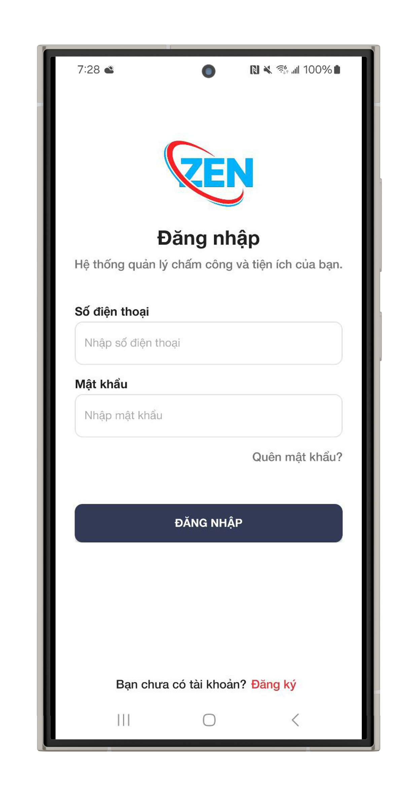
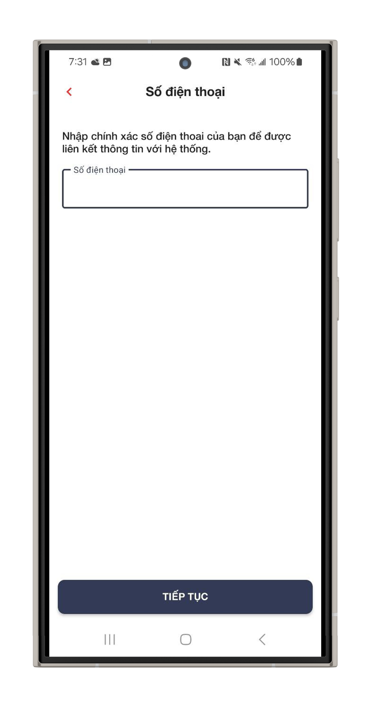
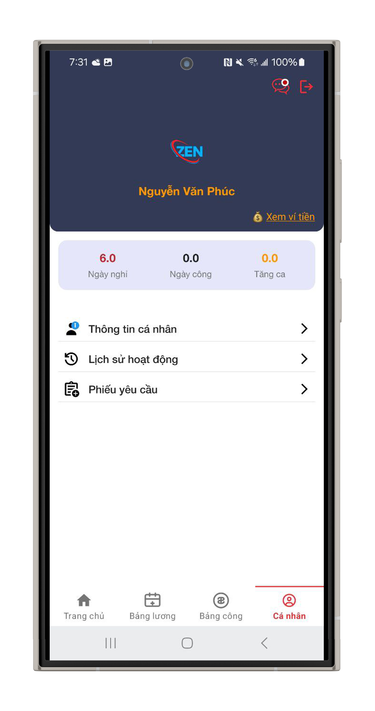
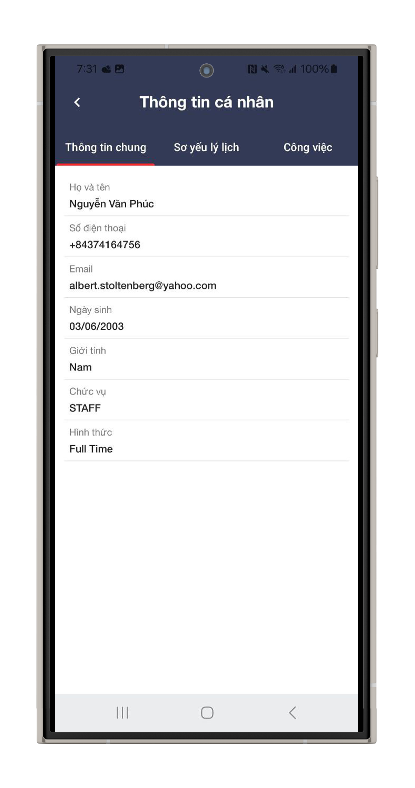
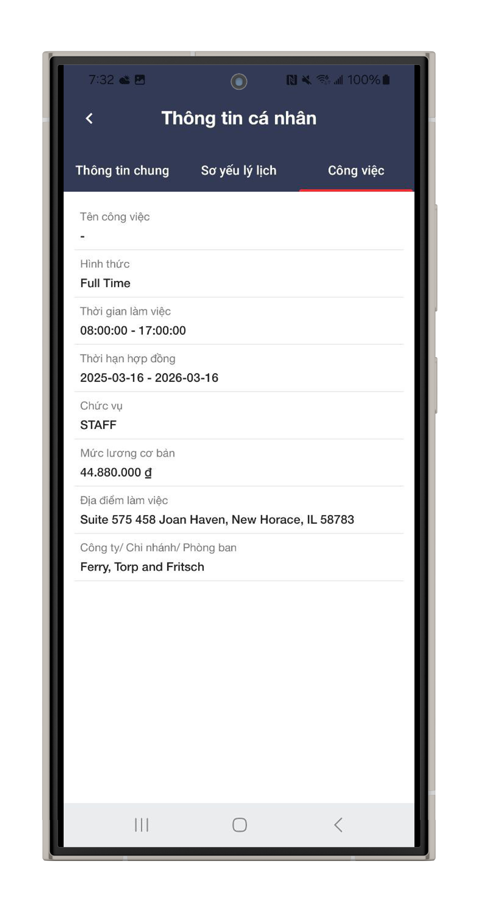
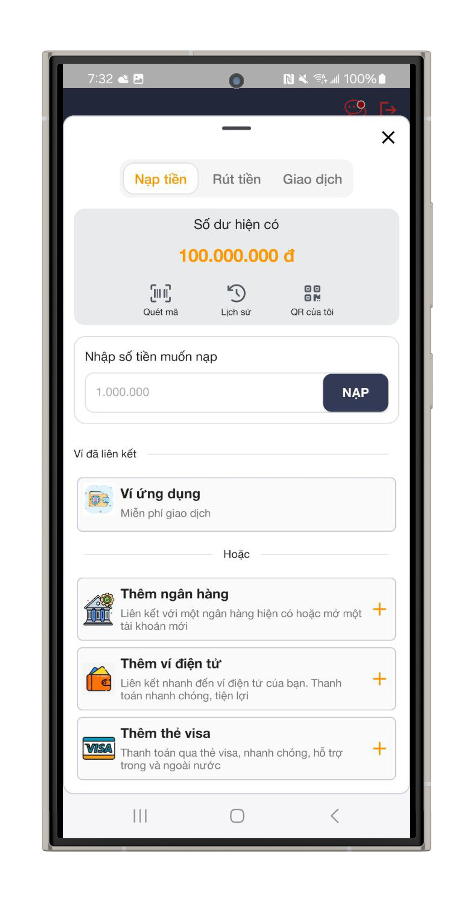
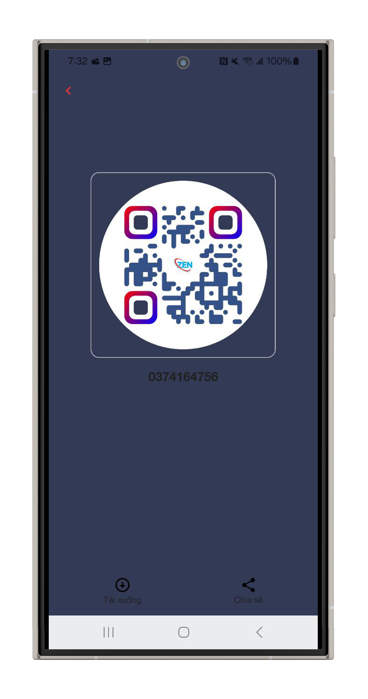
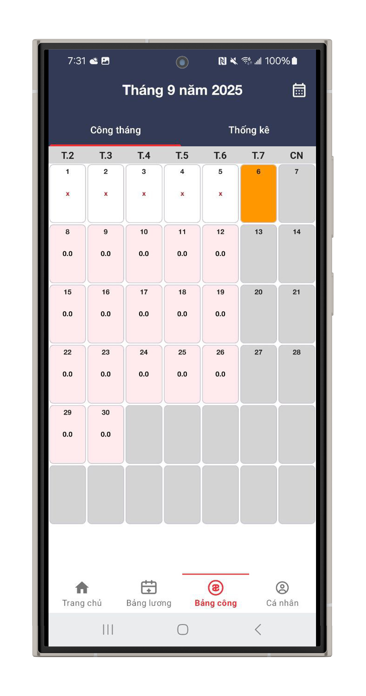
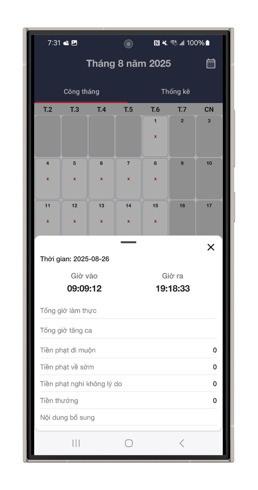
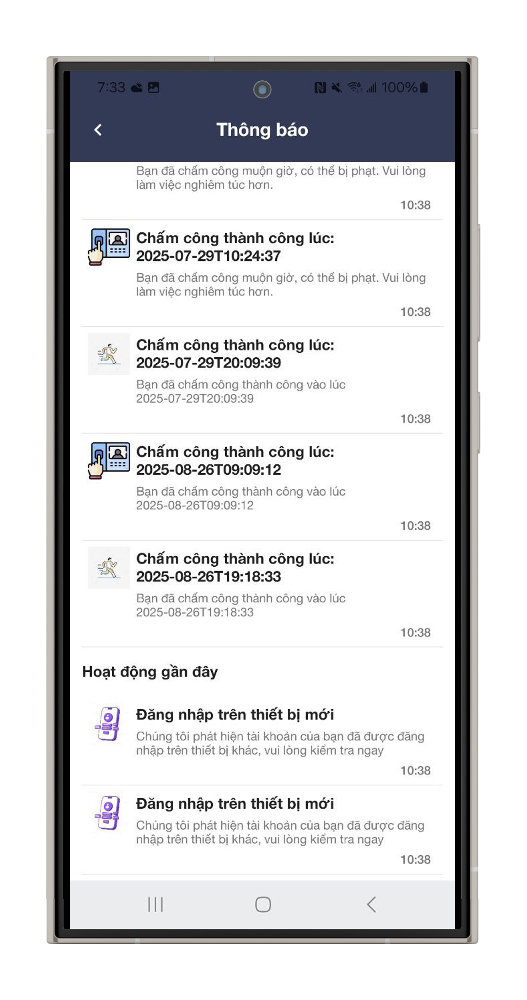

# 📱 HR Attendance Management App  

Ứng dụng quản lý nhân sự hỗ trợ chấm công, check-in/out, quản lý thông tin nhân viên, thống kê – báo cáo, và rút lương trực tiếp. 

---

## 🚀 Tính năng chính  
- ✅ Check-in / Check-out bằng GPS hoặc Camera  
- ✅ Quản lý hồ sơ nhân viên  
- ✅ Thống kê công và xuất báo cáo chi tiết  
- ✅ Thanh toán / rút lương trực tiếp từ ứng dụng  
<!-- - ✅ Chatbot HR hỗ trợ giải đáp thắc mắc  
- ✅ AI phát hiện bất thường trong dữ liệu chấm công   -->

---

## 🛠️ Công nghệ sử dụng  
- **Ngôn ngữ**: Kotlin  
- **UI**: XML
- **Architecture**: MVP + Clean Architecture  
- **Database**: Realm
- **Networking**: Retrofit + OkHttp  
- **Dependency Injection**: Hilt  
- **Khác**: Coroutines / Flow, ...  

---

## 📂 Cấu trúc thư mục
```  
app/
├─ data/ # Datasource, API
├─ domain/ # Repository, Entity, UseCase
├─ core/ # Extension, BaseClass, CustomView
├─ networks/ # API config
├─ ui/ # Activity, Fragment, Compose UI
│ ├─ home/
│ ├─ auth/
│ └─ profile/
├─ utils/ # Helper, Extension

```

## ⚙️ Cài đặt & chạy  
1. Clone repo  
   ```bash
   git clone https://github.com/yourname/hr-attendance-app.git


### 2. 🔑 Cấu hình môi trường (Environment setup)  
Config base url trong build.grade (app):  
```markdown
## 🔑 Cấu hình môi trường  
  ```build.gradle.kts
  API_BASE_URL=your_api_key_here
  WEB_SOCKET_URL=https://api.example.com/
  ```

### 3. 📸 Screenshot 
#### 3.1. Authentication



#### 3.1. Profile





#### 3.1. Wallet




#### 3.1. Work




#### 3.1. Notification



### 4. 📄 License  
- Thực hiện bởi: PhucDev-IT

### 6. Source Backend
- java spring: 
